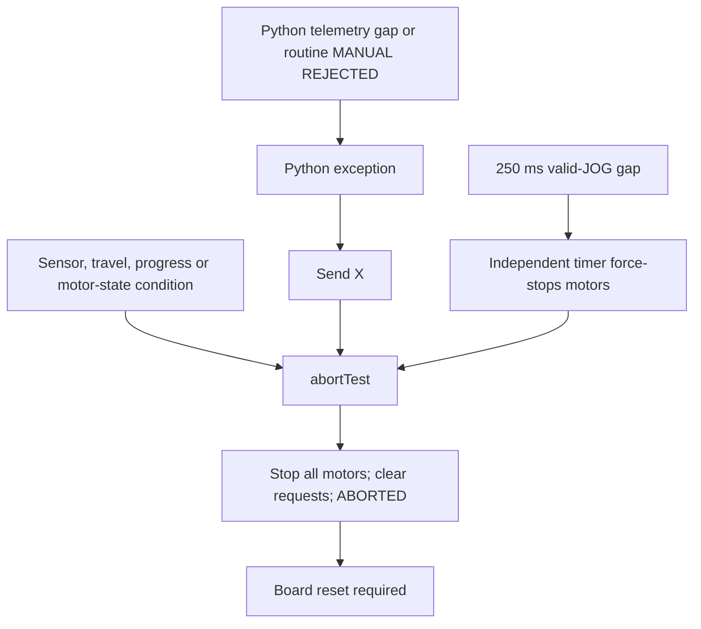

# M09 manual-control simplification audit and approval proposal

Date: 2026-09-26. **Audit only; no behavioral changes approved or implemented.**

## Scope and findings

I inspected the current M09 firmware, Python client, shared hardware definitions,
installed BNO/FastAccelStepper libraries, relevant tests and historical encoder
code. This is an audit of the working tree at commit `b9f10a6` ("M09: Xbox control
working on all three axes"), not a readback of the ESP32's current flash.
No serial connection, upload or powered-hardware action was performed.

The main problem is coupling: manual rate commands are still embedded in an
automatic north/level diagnostic state machine. Most sensor and individual-axis
conditions call one reset-required, three-motor abort function. Python additionally
turns some harmless firmware rejections and receive-channel delays into that same
global abort. These requirements are not intrinsic to supervised velocity jogging.

The most consequential findings are:

- The normal 20-second wait is 5 seconds of initial acquisition followed by
  repeated one-second reference windows until a shared 20-second deadline.
- Manual accepts accuracy 0–3, but still requires a successful BNO/pitch baseline,
  fresh BNO data, and a new BNO sample to service every axis, including carriage
  and STOP braking. Removing only the accuracy threshold did not remove that dependency.
- A BNO gap of 150 ms faults the entire machine, even when already stopped/idle.
- Normal command rejection is nonfatal in firmware, but Python treats every
  `MANUAL REJECTED:` line as an exception and sends the global `X` abort.
- The automatic startup can reach its targets correctly and still fail because
  both motors did not demonstrate simultaneous movement.
- A product-ID operation inside the BNO library has no operation timeout. An
  ACKing but nonresponsive sensor can hang setup indefinitely.
- Current M09 does **not read either AS5600**. No current encoder reading can be
  responsible for a shutdown. Old repository instructions describe v05, not M09.
- The actual Python default speed scale is **1.0**, while its help text, README
  and a test still describe 0.25. A default launch requests full native ceilings.

Existing local edits were preserved: `src/control_math.h` has precision
`ACCELERATION=250` and `PITCH_PULSES_PER_ERROR_DEG=24.0`, versus committed 240/64.
Those precision parameters are distinct from manual acceleration limits.

## How failures propagate

In the tables below, **global abort** means this exact chain:

`abortTest(reason)` → `finish(false, reason)` → `stopMotors()` → all three
`forceStop()` calls → 25 ms delay → STEP outputs LOW → both watchdogs disarmed →
all manual requests/activity cleared → `Phase::ABORTED` → reset required.

Sources: [main.cpp](../src/main.cpp), lines 162–178, 217–223 and 680–684. The aborted
loop no longer polls the BNO, so sensor recovery cannot restore readiness.
This is a latched application state, not necessarily an ESP32 crash or reboot.

**Command rejection** means a message and no new motion command. Firmware
`rejectManual` and `rejectPose` themselves do not call the global abort. Python
escalates `MANUAL REJECTED` through its exception/cleanup path, however.

## Startup: every significant delay and gate

Sources: `src/main.cpp:22–29, 306–321, 439–457, 644–729`;
`src/sensor_support.h:14–38`; installed Adafruit/SH2 sources noted below.

| Gate or wait | Exact current trigger and consequence | Why it exists; judgment for manual testing |
| --- | --- | --- |
| UART startup wait | Unconditional `delay(500)` before motor setup, main:645. | Likely serial/diagnostic convenience. Remove from manual readiness; motors do not need this half-second delay. |
| STEP initialization | Configure each STEP output LOW before engine setup, main:646. | Retain: establishes an inactive output rather than accidental pulses during setup. |
| Motor allocation/init | Any of three FastAccelStepper motor pointers null → global abort, main:661–664. | Valid pulse generation is essential. Keep refusing motion with failed hardware setup. Per-axis availability is possible, but pervasive pointer assumptions make that a separate change, not something to hide in this pass. |
| Initial speed/acceleration configuration | Any setter returns failure → global abort, main:667–669. | Retain valid configuration requirement; otherwise intended speed/ramp cannot be assumed. A shared startup control failure is a defensible whole-controller stop. |
| BNO watchdog creation | Invalid configuration, timer creation/start failure → global abort, main:671 and watchdog:20–37. | Necessary only for the existing BNO feedback controller. Failure should disable that capability, not manual pulses. |
| Command watchdog creation | Same mechanisms, separate timer instance → global abort, main:672. | Retain prerequisite for continuous manual motion: without it a dead host or blocked loop can leave hardware pulses running. |
| Bus B setup/probe | Wire1 begin fails, or address 0x4A does not ACK → global abort, main:673–675. Per-transaction I2C timeout is 50 ms. | Convert to BNO-unavailable warning. Motor pulses do not require this I2C device. Keep bounded transport calls. |
| BNO initialization/report | `begin_I2C` or `enableReport` false → global abort, main:676–677. | Disable sensor-dependent functions only. No calibration quality need be asserted for manual readiness. |
| Report-enable completion | Installed SH2 `setSensorConfig` completes after transmitting the feature command, `sh2.c:837–845`; it does not wait for a feature-response acknowledgement. | No additional response/calibration wait is hidden here. Keep reporting failure to send, scoped to sensor availability. |
| BNO software reset | Adafruit `i2chal_open`: up to five reset writes, 30 ms after failed writes, then 300 ms after success; `Adafruit_BNO08x.cpp:286–300`. | Real sensor boot behavior. Keep the proven transaction; removing the 20-second manual gate is more useful than guessing a shorter sensor reset delay. |
| Reset notification wait | SH2 open waits up to 200 ms, plus transaction overhead; `sh2.c:1744–1756`. | Sensor-specific initialization; not a reason to make sensor success mandatory for motors. |
| Product-ID response | `getProdIdOp.timeout_us` is zero; `opProcess` loops without a deadline when zero. `sh2.c:478–500,747–750`; Adafruit calls it at199–203. | **Unbounded setup wait.** Bound this existing operation using the SH2 operation-timeout mechanism. A Wire timeout does not bound an unlimited sequence of transactions. Merely replacing failure messages is insufficient. |
| Failed I2C write wrapper | `DiagnosticBno085::checkedWrite` converts a failed HAL write returning 0 into `SH2_ERR_IO`. | Retain: avoids the library's retry-forever interpretation of zero. It fixes failed writes, not missing product-ID replies. |
| Acquisition hold | After BNO/report success, wait exactly 5000 ms before collecting baseline windows, main:678,688. | Remove from manual readiness. Optional reference acquisition may use sensor data independently. |
| North baseline | One-second window, ≥30 heading/roll/good-accuracy samples; both half-windows populated; no invalid/reset interruption; every sample accuracy≥2; no gap>100 ms; latest sample age<150 ms; heading/roll SD≤0.15°, ranges≤0.5°, half-mean changes≤0.2°. Failed windows restart until20 s. | Defensible reference-quality criteria, not motor initialization. Scope to optional north/reference availability. |
| Pitch fallback | At20 s, accept pitch only if its equivalent stability/freshness checks pass; calibration and heading stability not required. If even this fails, global abort. | No reason for a pitch-reference failure to prevent carriage or raw manual rates. Remove as a manual gate. |
| Automatic north/level move | Successful north baseline starts both feedback controllers, targeting heading0 and physical roll0, before manual READY. | Remove automatic movement from ordinary manual startup. Obtaining orientation/reference and moving the machine are separate operations. |
| Automatic completion | Requires HOLD, target errors≤0.4°, stopped motors, carriage at target, required accuracy, then1 s/≥30 settled samples with gaps≤100 ms. | Keep for explicitly requested automatic positioning, not manual readiness. |
| Demonstration evidence | Even settled startup calls failure unless `sawYawMotion && sawPitchMotion && concurrentMotion`, main:453–457. | Remove as an operating prerequisite. Already being at target, or moving only one axis, is not a malfunction. Keep the information only if useful in telemetry. |
| Main/host cadence | Firmware delay1 ms/loop; Python sleep5 ms, JOG20 ms, STATUS500 ms. | These do not explain20 s. Keep normal cooperative scheduling and no catch-up bursts. |
| Finishing/aborting | `stopMotors` delays25 ms after forceStop. | Shutdown behavior, not the20-second startup wait. Do not remove casually; queued pulse commands take time to stop. |

The baseline budget is **5 s + approximately 15 s of repeated windows**, not5+20.
Boot, UART delay and library initialization occur before that budget. The previous
same-hardware [captures](HARDWARE_RESULTS.md) reached pitch-only around21.3 s.
A successful north window can instead begin automatic motion around6 s; readiness
then waits for that movement/settling, with a90 s motion deadline.

## Shared firmware shutdown conditions

Source: `src/main.cpp:225–291`. Each global condition below can stop unrelated axes.

| Condition | Exact trigger/current effect | Proposed disposition and reason |
| --- | --- | --- |
| Command stream lost | Manual active;250 ms since valid accepted JOG; independent watchdog trips → global abort. STATUS and malformed/partial JOG do not renew it. | **Retain independent stop**, initially keeping250 ms. Make it a recoverable manual stop, not reset-required. Apply to commanded continuous movement/braking as appropriate, not stationary idle. Without it autonomous STEP generation can outlive the controlling process. |
| BNO stale while idle | COMPLETE/ready and accepted sample age≥150 ms → global abort, even all motors stopped. | Remove global effect. Invalidate dependent references/availability; no moving motor needs an emergency stop here. |
| BNO stale during operation | Age≥150 ms or BNO watchdog tripped → global abort. | Scope to an active BNO-dependent positioning operation. Manual and carriage-only stepping have no mathematical need for fresh BNO data. |
| Low accuracy with yaw required | `yawRequired && accuracy<2` → immediate global abort. | Keep north-quality qualification for automatic north/yaw, but cancel that operation and remain manually usable. Already disabled for manual by its flags. |
| Low accuracy grace | `accuracyRequired` and continuously<2 for1000 ms → global abort. | Remove magnetic quality requirement from carriage. Keep only a truly dependent operation's qualification; yaw currently stops immediately rather than using this grace. |
| Yaw travel guard | Absolute continuous heading displacement from north target, or pitch-only startup yaw, ≥185° → global abort. | Remove from supervised manual path: magnetic/startup yaw is not a proven mechanical endpoint. Keep automatic command-domain constraints scoped to that controller pending separate review. Removing manual guard means operator must supervise cable/travel; no encoder guard currently replaces it. |
| Pitch guard | Absolute BNO **roll**≥75° → global abort. | Remove from BNO-independent manual path. Retain working automated pitch target bounds within BNO-dependent functions. Otherwise this one IMU remains a manual single point of failure. |
| Carriage guard | Generated position<−500 or>500 since boot → global abort. | Remove arbitrary startup-relative restriction as requested; no substitute positional window. These counts do not establish rail clearance. |
| Overall deadline |90 s since operation start → global abort. Manual resets it only after all requests, motors, braking and observation are idle. | Remove from valid continuous manual jogging; the command-loss failsafe addresses abandonment. Retain for failed automatic convergence. |
| BNO reset | Reset after north reference or pitch baseline → global abort. Before readiness, clear heading and re-enable report. | Invalidate/reacquire only orientation/reference information and cancel any dependent positioning operation. Raw JOG remains available. |
| Invalid quaternion | Nonfinite/nonpositive norm or nonfinite Euler conversion: discard sample, count invalid, interrupt baseline. Repeated invalid data causes stale abort indirectly. | Retain invalid-value rejection; remove propagation to unrelated manual operation. Using invalid numbers would corrupt reference/control math. |
| Ambiguous heading | Nonfinite heading or exactly±180° unresolved sample delta in HeadingTracker → global abort. | Keep rejecting ambiguous integration; invalidate heading capability, not motor control. This check does not reject all smaller unrealistic jumps. |
| Wrong/no report | Only valid `SH2_ROTATION_VECTOR` can refresh orientation/status/freshness. Other reports/no report eventually meet stale threshold. | Keep report selection. Change only the capability affected by absence. |
| BNO report retry | When initialized but disabled, try report enabling after500 ms. Initial failure and post-ready reset normally abort before useful recovery. | Keep recovery sensor-specific and bounded; avoid reset/retry loops blocking manual commands. Do not add a new watchdog. |

`sensor_support.h` also contains500 ms stale and2000 ms persistent-health counters.
They are diagnostic bookkeeping in this executable, **not additional active
shutdown thresholds**; M09 does not act on `persistentTestFailure`.

The two MotionWatchdog instances check via an ESP timer task every10 ms, independent
of the foreground loop (`src/motion_watchdog.h:18–95`). They force-stop all stored
motor pointers. A trip cannot currently be cleared by `disarm()` or new data;
`arm()` requires internal state zero. This is why ordinary recovery requires reset.
Timer scheduling and already queued motor pulses mean150/250 ms are stop-request
deadlines, not instantaneous physical stopping guarantees. Retain the independent
command mechanism; a foreground-only timer would not protect against a blocked loop.

## Manual admission, motion and carriage conditions

Source: [manual_control.h](../src/manual_control.h). All numbers below are current.

| Condition | Trigger/current effect | Proposed disposition and reason |
| --- | --- | --- |
| Manual READY/admission,7–25 | Requires completed startup, `pitchReady`, fresh valid BNO, both watchdogs untripped, all three motors stopped. Arms both watchdogs. Failure rejects or globally aborts if watchdog arm fails. | Keep initialized motor control, deliberate admission and non-overlap with active automatic operation. Remove pitch/BNO/BNO-watchdog prerequisites. Command-watchdog functionality remains essential. |
| JOG format,49–56 | Two or three finite integer values in[−1000,1000]; optional carriage defaults0. Wrong count, NaN/Inf, fractions/out-of-range values reject without refreshing lease. | Retain. Prevents unintended or unbounded commands; malformed bytes must not keep old continuous motion alive. Python must not turn rejection into global abort. |
| First JOG,58–60 | Any nonzero first request rejected; first accepted command is all zeros. | Retain centered deliberate enable. Avoids motion immediately on entering manual mode. |
| JOG while stopping,63 | Reject until STOP completes; no lease renewal. | Retain sequencing to avoid restarting a braking motor. Make host handling recoverable. |
| Data-driven service,186–193 | Entire manual service returns if BNO not fresh or no new accepted sample. Affects yaw, pitch, carriage and zero/STOP/reversal handling. | Remove this coupling; service motor requests from existing loop/command state. Otherwise a sensor problem still blocks stopping normally even if admission checks are removed. |
| Wrong-direction/runaway,77–80 | Signed displacement retreats>0.6° below its best value since current direction started → global abort. Checked **before braking branch**. | Remove from raw manual mode. Magnetically fused orientation corrections, noise or backlash can violate it; no closed-loop target is being pursued. Keep equivalent error-growth protection for BNO automatic positioning only. |
| No measured progress,83–86 | Need another0.15° signed advance; fail after2 s at rate≥40 Hz,15 s below40 Hz, unless already marked braking. | Remove from manual. Small deliberate rates and poorly resolved/variable BNO response are valid manual tests. It does not prove a stalled physical shaft. |
| Release/reversal,89–104 | Zero/opposite request calls stopMove; wait for stopped motor, then100 ms observation before reversal/restart. | Retain acceleration-limited braking and direction sequencing. Remove dependence on new BNO samples for this wait. Otherwise abrupt reversal or stale command state can cause rough motion. |
| Braking deadline,91 | Motor reports running≥3 s after stop request → global abort. | Retain a bounded way to end a failed stop, but force-stop/report the affected axis rather than latch unrelated axes. At native ramps nominal stop time≤1 s, so3 s is a real failure check, not the normal stopping period. |
| Stopping margin,107–111 | Remaining yaw/pitch travel in requested direction≤retained BNO-derived braking margin → global abort. | Remove from manual along with BNO angular envelope. Retain automated approach braking as part of its controller. |
| Unexpected stopped motor,115 | Nonzero tracked direction, still requesting that direction, motor not running and not in normal braking/observation → global abort. | Report that axis error, reconcile its stopped state and clear the failed request; no need disable healthy axes. A later valid JOG may retry, including a held stick's next frame. Clearing a request is not a latched fault; no new per-axis interlock is proposed. |
| Motor API rejection,118–124 | Speed, acceleration or runForward/runBackward fails → global abort. | Retain detection and reject/stop affected axis. Ignoring an API failure could leave previous speed/state active; whole-board reset is excessive for a per-axis failure. |
| Speed and acceleration limits,113–129 | Signed normalized command maps to yaw≤1000 Hz, pitch≤600 Hz, carriage≤1000 Hz; accelerations1000/600/1000 steps/s². Rates round to at least1 Hz for a nonzero command. | Retain proven electrical/mechanical rate/ramp limits. Removing positional restrictions does not justify increasing motor stress or losing steps. |
| Carriage bounded target,164–176 | Manual rate is applied to a finite target at±500 boot steps. Holding outward at endpoint produces no new motion; inward motion allowed. | Replace with the same existing continuous velocity API used by yaw/pitch. Remove endpoint target/hold entirely, with no replacement arbitrary limit. |
| Carriage premature stop,138–144 | Stopped motor while tracked moving, neither intentional braking nor exactly at expected±500 boundary → global abort. | Remove boundary assumption. A real unexpected stop should remain an axis-local report/recoverable stop. |
| Carriage near-endpoint brake,154–162 | Computes `v²/(2a)+0.05v+2` steps; release/reversal calls stopMove only if farther away, otherwise retains finite endpoint ramp. | Remove this entire boundary-specific workaround once finite endpoints are removed. Ordinary velocity stopMove suffices; no new margin needed. |
| Carriage braking deadline,140 | Still running≥3 s during intentional brake → global abort. | Same axis-local bounded-stop handling as yaw/pitch; retain failure detection without global disarm. |
| Carriage API failure,169–176 | Configuration/moveTo failure → global abort. | Preserve error handling scoped to carriage, using continuous run API after restriction removal. |
| STOP,38–46 and194–202 | Zero all requests, disarm command watchdog, keep BNO watchdog; wait for all three motors stopped and braking/observation complete, then manual off and READY. | Retain explicit all-axis STOP. Make its servicing BNO-independent. Individual centered stick axes must stop independently without disarming the session. |
| Explicit X/x | Byte recognized immediately, even inside partial command, main:597–601 → global abort. | Retain as deliberate operator abort. It must no longer be the automatic response to ordinary host/sensor warnings. |

### Why the manual stopping margin can become unexpectedly large

`main.cpp:341–351` updates angular speed from100 ms BNO displacement and retains
the **largest absolute speed for the entire armed session**. Both native
speed/acceleration ratios are1 s. Therefore `control_math.h:39–45` reduces to:

- yaw margin =4° + peak angular speed ×1 s;
- pitch margin =2° + peak angular speed ×1 s.

A hypothetical50°/s peak leaves a52° pitch margin even after the stick is slowed.
At physical roll27°, outward remaining travel is48°, so that guard aborts the
whole machine before reaching75°. A sensor correction can enlarge the retained
peak too. This calculation explains a possible nuisance mechanism; no current
hardware log proves it caused a particular reported stop. The source message is
**"Manual pitch stopping margin reached"**, not "bearing margin".

## Exact paths for the reported messages and interactions

1. **"Manual yaw/pitch wrong-direction/runaway guard"**: accepted BNO event →
   manual service → signed displacement0.6° behind best → `abortTest` → all motors
   stopped/ABORTED → firmware FAIL → Python exception → Python sends anotherX.
   It can trigger while decelerating because the displacement test precedes the
   braking-state branch.
2. **"Firmware telemetry lost; stopping"**: Python sees no nonempty line for>1 s
   while arming/active/stopping → RuntimeError → cleanup writesX → same global abort.
   Outgoing JOG may have remained perfectly healthy throughout.
3. **"Manual continuous motor stopped unexpectedly"**: motor-state check at
   manual:115 → same global abort. Normal STOP/reversal marks braking first, and
   that branch bypasses this check. A normal stop alone is not a demonstrated bug.
4. **"Manual pitch/yaw stopping margin reached"**: manual:110 calls global abort
   directly. It is already a whole-system stop, not an axis stop that later needs
   another guard to fail.
5. **"Manual carriage stopped before its boundary"**: finite carriage state does
   not match either ordinary braking or exact endpoint → global abort. Once
   startup-relative endpoints are removed, this test no longer has valid meaning.

Confirmed coupling in source:

- A routine firmware manual rejection becomes a host-generated globalX.
- Received STOP still waits on fresh BNO samples; BNO failure can convert normal
  deceleration into a150 ms global stale abort.
- STOP disarms the command watchdog, but Python's1 s telemetry and4 s transition
  timers can still convert delayed stop acknowledgement into globalX.
  It disarms before manual service actually issues motor braking. When removing
  manual BNO dependence, preserve the existing command watchdog through that
  handoff: merely receiving STOP or zero requests does not stop hardware pulses.
  Release the command watchdog only after braking is issued or motors are stopped.
- Python's100 ms scheduling thresholds can abort before the firmware's250 ms
  command-loss deadline has even elapsed.
- Retained peak BNO velocity can cause much later margin aborts at lower speeds.
- Automatic startup at an already-correct pose can fail the simultaneous-motion
  evidence requirement despite correct settling.

Not proven: a normal intentional stop being directly misclassified as unexpected.
Automatic stopping sets BRAKING immediately; manual stopping sets its braking
flag; finite carriage endpoints are recognized. An independent watchdog can stop
motors between foreground checks, so another observed-state message could win a
race, but that is a code-order possibility, not a diagnosed physical root cause.

## Automatic POSE/MOVE: gates that should stay within that feature

These are not prerequisites for raw manual velocity. Retaining an automatic
operation's validity/convergence checks does not justify disabling manual mode
after that operation fails. Sources: `main.cpp:323–578`, `pose_math.h`.

| Gate | Trigger/current outcome | Recommendation and specific reason |
| --- | --- | --- |
| Busy/latched/readiness | Not completed-idle, no pitch baseline, stale BNO, or tripped BNO watchdog → POSE rejected. | Keep exclusive operation ownership. Require BNO only for requested angular feedback; not a carriage-only relative MOVE. Make prior feature failure recoverable. |
| Relative yaw syntax | MOVE yaw outside[−180°,180°) rejected. | Retain existing shortest-turn command semantics; otherwise a request can ambiguously mean a full rotation. Not a manual-stick limit. |
| Finite target/domain | Nonfinite angles or pitch target at/outside±75° rejected. | Retain mathematical validity and established automatic-controller domain. Invalid targets can corrupt motion planning. |
| Yaw endpoint | Computed shortest path endpoint at/outside±185° from continuous north target rejected. | Keep scoped to automatic yaw pending physical travel review. It does not establish a valid manual mechanical boundary. |
| Carriage endpoint | Target outside±500 generated boot steps rejected. | Remove this arbitrary restriction consistently with the shared guard/manual endpoint. Keep integer representability, not a replacement distance limit. |
| North admission | No reference or accuracy<2, with requested yaw error>0.4° → rejection. | Retain for absolute magnetic-heading functions; without it the function claims a reference it does not possess. |
| Carriage north dependency | Same low/missing north condition plus any carriage movement → rejection. | Remove for carriage-only step movement. Magnetometer quality does not establish linear position or affect step generation. |
| Learned angular response | Moving angular axis with pulses-per-degree estimate≤0 → rejection in full-reference path. Pure pitch fallback already uses native controller. | Keep explicit until timing bootstrap is separately resolved; inventing gearing would produce misleading synchronized estimates. See startup dependency below. |
| Timing duration | Nonfinite estimates, duration≤0 or≥89 s rejected. | Retain within existing coordinated POSE: predicted movement must fit the90 s operation budget plus1 s settling. No equivalent manual deadline needed. |
| Timing feasibility | No valid speed cap; nonpositive/nonfinite gearing; cap outside1..native; predicted burst≥3.9 s; predicted0.15° progress taking≥14.5 s precision or≥1.75 s slew; ≥2048 predicted corrections; noncontracting/nonfinite correction → unusable plan/rejection. | Retain planner consistency checks. They prevent a plan guaranteed to violate the current automatic controller's deadlines. They are not manual safeguards. |
| Approximate synchronization | Prediction differs from common duration by>max(0.5 s,10%) → `timingLimited=true`, not a rejection. | Keep honest diagnostic; do not confuse it with a stop/fault. |
| Already at target | All requested changes within tolerance/zero steps → informational no-op. | Retain; no movement is a successful valid result. |
| Watchdog admission | BNO watchdog cannot arm after pose setup → global abort. | Retain no-start for that feedback operation; unrelated manual mode should remain available. |
| Error grows | Absolute error>best error+0.6° → global abort. | Retain operation-level stop: a feedback controller driving away from target can otherwise keep driving. Do not apply it to open-loop manual velocity. |
| Yaw direction probe | Before confirmation,4-step probes; cumulative error improvement≥0.3° confirms yaw direction. | Preserve working automatic controller. No need for manual readiness. |
| No feedback progress | Outside0.4° tolerance, no0.15° improvement within2 s slew/15 s precision → global abort. | Retain operation-level failed-convergence stop; prevents prolonged automatic driving without observed response. |
| Command deferral | Finished, stale, watchdog tripped, motor already running, or automatic yaw lacks required reference/accuracy → no next command. | Retain within automatic control: prevents overlapping commands and calculations from invalid feedback. |
| Slew vs correction | Confirmed axis with error>braking threshold+2° slews; otherwise finite corrections. Correction zero inside0.10°, normally2..200 steps, unconfirmed maximum4. | Retain known working convergence algorithm; changing it is unrelated to manual simplification. |
| Motor API failures | Slew/correction/carriage move/configuration rejected → global abort. | Cancel the affected positioning operation, report cause; do not permanently disable unrelated future manual use. Ignoring errors could leave an old rate/target active. |
| Unexpected slew stop | SLEW but motor no longer running → global abort. | Retain operation-level error reporting; do not auto-restart a controller whose motor state diverged. |
| Normal automatic brake | Error within braking margin or direction changes → stopMove and BRAKING immediately. | Retain smooth approach; this is intended operation, not a failure. |
| Brake/burst deadline | Still running after3 s braking or4 s finite correction → global abort. | Retain bounded termination of a failed operation; stop only its participating axes and return manual availability. |
| Post-stop observation/HOLD |100 ms fresh-sample observation; enter HOLD≤0.10°; leave HOLD if>0.4°. | Retain for feedback settling. Not required to decide whether a raw manual motor has stopped. |
| Settling | All participating errors≤0.4°, HOLD, motors stopped, carriage at generated target, required accuracy; ≥30 samples for1 s with gaps≤100 ms. | Retain definition of automatic completion. Failure to settle is not proof the entire controller must be reset. |

Parser checks (`main.cpp:576–609`): exact POSE/MOVE argument count, finite angles,
int32-representable carriage counts, no extra token, and bounded127-character
printable/tab line. Violations are rejected. Retain these command-validity checks:
without them accidental or corrupted input can become unintended motion. A rawX/x
is acted on before parsing, including if embedded in malformed input; keep its
documented emergency behavior and avoid sending arbitrary text to the command port.

**Important boot dependency:** the automatic north/level movement currently learns
`yawPulsesPerDegree`/`pitchPulsesPerDegree` for later coordinated POSE. Removing that
automatic movement also removes its normal initial timing evidence. There is no
separate N/L command in current M09. A fast-manual patch cannot honestly promise
unchanged first-boot coordinated POSE availability. My minimum proposal leaves
missing timing as an explicit POSE-specific unavailability reason, with no
fabricated gearing and no unrequested calibration movement. Restoring a first
explicit POSE's timing bootstrap would require its own scoped change; it is not
necessary for manual JOG or carriage-only step movement.

## Python client: every significant gate and stop path

Source: [xbox_control.py](../xbox_control.py). Nearly every exception below reaches
lines251–260, sets `failed=True`, writes `X\n`, then closes serial. The firmware
consequence is the same global latched abort described above.

| Host condition | Exact trigger/current outcome | Proposed disposition and reason |
| --- | --- | --- |
| CLI validation,112–132 | Invalid/nonnegative index requirements, duplicate axes, deadband outside0.05–0.5, speed scale outside(0,1] → parser exit before serial. | Retain valid configuration checks; no motor fault required. |
| Controller availability,143–148 | Missing selected controller/axis → exception before serial open. | Retain actionable no-input error. There is no trustworthy requested velocity. |
| Serial open/I/O,157–160 | COM9 at115200; reads nonblocking, writes time out at100 ms. Short write or I/O exception → cleanupX if possible. Opening may reset ESP32. | Retain detection; stop/end local session on actual broken command transport. Firmware's independent command watchdog handles failed delivery. Board reset need not be required for a host-side fault. |
| Deliberate arming,84–90,184–212 | Idle, exact READY received, any RX within1 s, all three selected raw axes inside deadband for0.5 s; Space/A. Refusal only adds UI text. | Keep centered deliberate arm and stopped/ready handshake. Remove dependence on unrelated telemetry recency as a proof of motor health; readiness acknowledgement still has meaning. |
| Arming protocol,100–108 | Send zeroJOG until `MANUAL READY:`; withhold nonzero input. | Retain existing minimal handshake. Otherwise stored stick displacement could start motors as soon as connection appears. |
| Routine `MANUAL REJECTED`,52–55 | Any rejection line raises, even malformed command, temporary BUSY or "stopping; wait" →X. | Remove global escalation. Show reason and resolve only that command/session state; firmware itself has not faulted. |
| Actual FAIL/ABORTED,52–55 | Received genuine firmware failure raises →X again. | Respect real failure and stop outgoing motion; preserve original reason. Another blanket abort is redundant. Explicit operatorX remains available. |
| READY during active/arming,60–62 | Raises "Firmware left manual mode unexpectedly" →X. | Treat genuine mode loss/restart as local session cancellation/rearm. A delayed STATUS READY while arming is also a plausible race, not necessarily a firmware failure. |
| BUSY while active,68–71 | Raises "Firmware restarted or became unavailable" →X. | Stop using prior input and return local idle; no permanent board fault for ordinary mode transition. |
| Telemetry gap,100–102 | No **nonempty line of any kind** for>1 s while arming/active/stopping → "Firmware telemetry lost; stopping" →X. | Warning only for active manual command delivery. Receive silence neither proves command loss nor motor failure. Keep distinguishing pending handshake from an already active stream. |
| Transition timeout,103–104 | Arming/stopping>4 s → exception/X;1 s RX timer may fail first. | Keep a bounded local pending transition and clear error; cancel/recover session, not board. A lost acknowledgement must not permanently disable healthy motors. |
| Loop delay,169–170 | Active/arming host iteration gap>100 ms →X. | Remove this duplicate global-fault timer. Desktop scheduling pauses do not imply failed motor control; existing command-loss stop covers sustained disappearance. |
| Input pump delay,173–174 | pygame event acquisition>100 ms →X. | Same. Resume by acquiring current input, not replaying queued old frames. No additional watchdog needed. |
| Whole-frame age,213–214 | Active/arming input processing age>100 ms before transmission →X. | Drop/reacquire an old input sample as needed; do not make UI latency a board-reset event. Preserve no catch-up bursts. |
| Controller disconnect,175–177 | Selected device removed, even idle →X. | Keep stop/local disarm when input disappears. Use ordinary STOP when transport works; watchdog covers failure to send. |
| Window focus loss,178–179 | While active/arming →X. | Keep recoverable STOP/local disarm for this focused-window UI. Without it keyboard stop focus can be lost while last controller state persists; no board reset is necessary. |
| Nonfinite stick input,11–14 | Value is NaN/Inf → exception/X. | Retain rejection/controlled local stop. An invalid input must not be converted into motor speed; avoid permanent system failure. |
| Receive-buffer overflow,196–197 | No terminated line and buffer>8192 characters →X. | Keep bounded parsing; report/drop malformed telemetry. A return-data formatting fault should not fault a healthy outgoing manual stream. |
| Other UI/render exceptions | Exception handler sendsX. | Best-effort ordinary STOP/close; command watchdog if host dies. Do not turn unrelated display errors into permanent firmware failure. |
| Space/A,92–98,205–212 | While active/arming sendsSTOP, enters stopping, no furtherJOG; READY returns idle. | Retain deliberate stop/disarm. Ensure late/stale status cannot escalate its normal completion. |
| Stick release,11–21,181–184 | Inside deadband gives exact zero for that axis; no Python temporal smoothing tail. | Retain; individual axes stop through existing motor acceleration without disabling other axes. |
| X/B,201–202 | Explicit operator abort → exception →X. | Retain deliberate global abort. Clear distinction from routine warnings is useful. |
| Ctrl+C,248–250 | Currently marks failed and sendsX. | Use ordinary stop/exit; explicitX/B already supplies deliberate latched abort. |
| Esc/window close,203–204,255–267 | Active/arming/stopping sendsSTOP then closes without waiting. Idle but not READY sendsX, including automatic startup. Idle READY sends nothing. Cleanup write errors swallowed. | Retain best-effort stop; once boot no longer moves automatically, normal pre-ready close need not abort board. Firmware command failsafe remains necessary because exit writes can fail. |

The host has **no independent AS5600 or BNO accuracy threshold**. It inherits
sensor failure through firmware READY/FAIL messages. Its telemetry timeout updates
on every nonempty received line, including ordinary STATUS text; it is not a
BNO-freshness check or a reliable acknowledgement of each motor command.

### Command loss, telemetry loss and firmware failure are different

| Event | What can actually be concluded | Required response in the proposed manual mode |
| --- | --- | --- |
| Valid JOG stops reaching ESP32 | Controller can no longer update continuous rates, regardless of cause. | Existing independent command timeout stops continuous motion; clear requests; allow deliberate centered rearm without resetting board. |
| Return telemetry is briefly missing | Host cannot see current status; outgoing commands may still work. | Report stale telemetry. Do not convert return-channel silence alone into globalX. Unacknowledged initial arming still must not send nonzeroJOG. |
| Python/input/serial process disappears | No further valid manual commands should arrive. | Firmware command timeout covers abandoned continuous motion; a best-effortSTOP can act sooner if host still runs. |
| ESP32 foreground blocks in sensor/library | Hardware STEP generator may continue independently. | Retain independent command-timeout mechanism; bound sensor operations so they do not obstruct the foreground indefinitely. |
| One motor's API/state fails | That axis did not follow the requested software state. | Stop/clear/report that axis or its coordinated operation; do not declare unrelated sensors or manual axes dead. |
| Shared motor engine/command-stop infrastructure cannot initialize | Continuous rate control cannot be provided with the required stop guarantee. | Refuse manual movement and report a real controller setup error. |

Do not automatically replay a pre-timeout nonzero JOG when communication returns.
Reuse the existing centered zero-JOG/arm transition after the recoverable stop.
This preserves intent without adding a new protocol or another interlock system.

## BNO accuracy: what it is and exactly what changes today

The enabled report is `SH2_ROTATION_VECTOR` (0x05), requested every10000 µs
(100 Hz). Installed `sh2_SensorValue.c:87` decodes status with `report[2] & 0x03`.
`main.cpp:274` rejects other report types before assignment at279. Quaternion
and heading validation also precede assignment. Other report types cannot overwrite
the accuracy variable in this source.

The main loop polls the sensor nominally every iteration, with a1 ms yield. Accuracy
changes only when an accepted rotation-vector event arrives, nominally100 Hz;
there is no independent slow accuracy polling timer. No sample/invalid sample leaves
the previous accuracy stored. At boot the variable starts0. Freshness uses ESP32
acceptance time (`millis()`), not the sensor event's timestamp.

| Context | Accuracy0 or1 | Accuracy2 or3 |
| --- | --- | --- |
| North baseline acquisition | Invalidates entire current north window; repeats until deadline. | Permits north acceptance only if all other window checks pass. |
| Pitch-only baseline | No direct accuracy prohibition. | Same. |
| Manual admission/active JOG | No direct accuracy prohibition; other BNO/baseline dependencies still apply. | Same. |
| Idle after valid north reference | `northUsable=false`; accuracy alone does not abort idle. | `northUsable=true` only if `referenceSet` exists. |
| Idle after pitch-only fallback | North remains unavailable, even if accuracy later improves. | No new north reference is established automatically. |
| Absolute automatic yaw | Immediate abort if yaw required. | Allowed subject to fresh data/reference/other guards. |
| Carriage-containing POSE without yaw |1-second low-accuracy grace, completion inhibited while low, then global abort. | Allowed; this magnetic dependency on carriage is unnecessary. |
| Pure pitch feedback motion | Explicitly disables accuracy requirement. | Same. |

The status levels mean0=unreliable,1=low,2=medium and3=high accuracy. They describe
the sensor's estimate, not an independently verified mechanical or north reference.
There is no requirement to pass through0→1→2→3 sequentially. Status1 is not±1°;
status3 is not±3°. The report also contains a separate heading uncertainty estimate
in radians, currently not displayed or used. These definitions come from the
[SH-2 manual, §§6.5.1 and6.5.18](https://cdn.sparkfun.com/assets/4/d/9/3/8/SH-2-Reference-Manual-v1.2.pdf).

The application does not configure dynamic calibration, save/load DCD explicitly,
or issue clear-DCD commands. Library initialization soft-resets the BNO. A sensor
reset is not proof that persisted calibration was erased; SH-2 §6.4.10 describes
non-power reset DCD handling separately from explicit clearing.

Why status can differ between apparently identical runs is **not established by
the current evidence**. Sensor-internal history, startup/reset timing, motion and
magnetic conditions are plausible influences. Manufacturer guidance describes
calibration in the assembled device and magnetic-environment dependence; it does
not promise a fixed startup convergence time. This is not evidence that the user
changed the physical setup. [Manufacturer calibration procedure](https://docs.sparkfun.com/SparkFun_VR_IMU_Breakout_BNO086_QWIIC/assets/component_documentation/BNO080-BNO085-Sesnor-Calibration-Procedure.pdf)

There is also a definite observability problem: normal STATE output stops in
COMPLETE/idle. During manual mode, MANUAL_STATE every250 ms resets the same
`lastDisplay` used by750 ms STATE, usually suppressing the latter. MANUAL_STATE
omits accuracy/freshness/north fields, and Python does not update its BNO panel from
it. The visible accuracy may be a startup snapshot even while firmware's internal
value changes. The panel shows receipt age, but that is not continuous live status.
Proposed correction: include existing BNO availability/status/last-valid age in
the existing telemetry flow, without adding a new sensor gate or stop mechanism.

## AS5600: present hardware, absent current acquisition

Current M09 and the inherited M08 code have no AS5600 object, initialization,
polling, angle read or encoder fault decision. Including `hardware_config.h`
does not initialize encoders. The platform configuration lists no AS5600 library.
Consequently **there is no active M09 AS5600 anomaly-to-global-abort path to remove**.

Historical `../../v05_Add_Additional_Sensors/v05_Add_Additional_Sensors.ino`:

- Lines150–184 warn if encoder initialization fails and continue startup.
- Lines438–451 probe pitch AS5600; lines474–487 returnNaN on failed I2C exchange
  or missing bytes. Those reads do not inherently trigger a whole-machine abort.
- Lines751–767 cancel only return-to-zero and set its desired rate0 when yaw
  encoder reference/read is unavailable. However its `isnan` read-failure test is
  ineffective for the current helper at432–435, which converts a uint16 raw angle
  to a finite float without an explicit error check.
- Lines784–813 refuse encoder-dependent keyframe operations when no encoder
  reference exists. That feature-scoped idea is useful; keyframes are not proposed
  for restoration in this pass.

Do not transplant old bus/pin assignments: v05 uses different bus wiring. Current
shared configuration identifies BusA18/19 and BusB4/5. Earlier pitch drivetrain
diagnostics describe that AS5600 as a **motor-shaft** measurement; it should not be
silently assumed to measure absolute cradle angle through unknown gearing/backlash.

Optional encoder initialization/telemetry would restore missing functionality,
not merely weaken an existing M09 fault. I recommend treating it as a separately
approved scope item: verify current bus/shaft mapping, reuse proven reads, report
per-encoder availability, and restrict only an operation actually relying on that
encoder if its data is invalid. No new encoder-based global gate or position limit
is proposed. The core manual simplification will not claim encoders are operating
when they are not.

## Smallest coherent proposal for approval

The proposal changes the ownership of existing requirements, not the PC/Python →
serial JOG → ESP32 hardware-timed motor architecture. M08, pins, BNO physical roll
mapping, direction signs, speed/acceleration ceilings and unrelated features remain
outside the change. No camera, astronomy, homing, keyframe or new protection system.

1. **Separate manual readiness from orientation readiness.** Initialize STEP LOW,
   FAS motors and existing command failsafe, attempt bounded optional BNO setup,
   then expose manual READY. Remove500 ms serial convenience delay,5 s wait,
   repeated20 s baseline gate, diagnostic simultaneous-motion requirement and
   automatic north/level travel from ordinary boot. Keep reference qualification
   within orientation-dependent capability, with no automatic movement.
2. **Make BNO optional throughout the path.** A warning-only setup error is not
   enough: remove manual `pitchReady/fresh/newSample` admission/service dependence,
   do not arm BNO stale watchdog for manual, and remove BNO-derived manual
   direction/progress/angular-travel/stopping-margin aborts. Preserve sensor
   validation, real status0–3, roll mapping and absolute-north qualification.
   BNO loss/reset invalidates dependent information and cancels an affected
   closed-loop operation, without latching the whole machine. Bound product-ID
   waiting through the existing SH2 operation timeout: a reproducible project-owned
   dependency patch sets `getProdIdOp.timeout_us=1000000`, leaving the shared
   `opProcess` mechanism unchanged. Do not rely on an ephemeral `.pio` library edit
   or introduce another watchdog.
3. **Remove the boot-relative carriage window coherently.** Remove manual finite
   ±500 targets, endpoint checks/workarounds, shared ±500 abort and arbitrary POSE
   step-window rejection. Retain int32 representability and motor speed/ramp limits.
   Use existing continuous run/update/stop calls for carriage. Operator supervises
   physical rail travel, as requested; no replacement arbitrary software window.
4. **Retain one simple independent manual command-loss failsafe.** Keep the
   existing250 ms valid-JOG deadline initially; it already distinguishes command
   delivery from telemetry. While continuous movement is requested, timeout stops
   motors and clears requests. Make recovery a normal stopped manual session with
   existing centered rearm, not ESP32 reset. Zero-command stationary idle needs no
   latched fault. Do not change timeout on the basis of receive-only telemetry gaps.
   Keep the watchdog active until STOP/zero requests have actually been handed to
   motor braking or the motors are stationary; receiving zeros alone is insufficient.
5. **Make normal stops and per-axis failures local/recoverable.** Keep motor ramp
   braking, reversal sequencing and100 ms stopped observation, serviced without
   BNO. Keep3 s failed-braking detection with force-stop/report limited to that
   axis/operation. Reconcile stopped state and clear a failed axis request; never
   blindly restart from a cached request. A later valid JOG may retry that axis,
   including the next frame from a held stick. No per-axis fault latch is added.
   Remove the90 s manual duration limit. Retain explicit operatorX as global abort,
   and retain real shared motor/control-infrastructure setup failure handling.
6. **Scope existing automatic dependencies honestly.** A BNO angular operation
   still needs valid orientation/reference; stop its coordinated participating
   axes if that operation loses essential feedback, then allow manual control.
   Existing carriage-only relative `MOVE 0 0 steps` must not need north/calibration.
   Preserve mathematical validation and automatic convergence checks. Leave
   missing angular timing evidence explicit; do not silently invent a first-boot
   coordinated POSE plan after automatic reference movement is removed.
7. **Simplify Python escalation and make status truthful.** Preserve mappings,
   JOG syntax, deadband/curve, explicit centered arm, STOP and deliberateX/B.
   Telemetry gaps become visible warnings. Routine rejection, focus/input loss,
   handshake issues and UI exceptions use recoverable command/session handling,
   not automatic globalX. Remove100 ms host scheduling faults that duplicate the
   firmware failsafe; reacquire current input before resuming. Update existing
   telemetry so BNO validity/status/age are current even while idle/manual.
   Reconcile speed-scale help/test with the actual1.0 setting; do not silently
   change the user's current speed choice.

### Fastest reasonable startup target

There is no need for a20-second manual startup window. Target manual availability
after motor setup and **one bounded BNO initialization attempt**, without waiting
for calibration, reference stability, or physical movement. Keep the documented
300 ms sensor boot delay. With the500 ms application delay removed, healthy startup
should be on the order of a second rather than20 seconds; this is an engineering
target, not a measured guarantee. A proposed1-second product-ID response deadline
would bound that currently unlimited sub-operation; final boot budget must include
the existing reset wait and bounded I2C transactions. A missing/nonresponding
sensor must finish as a warning and leave manual READY.

Publishing READY immediately before an unchanged blocking BNO initialization is
**not** a solution: loop would still be unable to process JOG. Bound the sensor
call first. Avoid uncontrolled reset/retry loops during active manual movement;
existing report recovery must yield to command processing and expose failure as
sensor unavailability. Optional orientation reference may qualify after readiness
when valid data is available; an invalid reference must never be labeled north.

### What remains deliberately retained

- Hardware timer pulse generation, known pins/signs and speed/acceleration ceilings:
  otherwise motion can become rough, misrouted, or exceed established capabilities.
- Valid command syntax/ranges and bounded parsing: otherwise bad input can issue
  unintended rates or hold previous continuous motion indefinitely.
- Centered deliberate arming and ordinary STOP/reversal sequencing: otherwise
  stale stick displacement or immediate reversal can cause unintended movement.
- Independent command-loss stop: otherwise disconnected/frozen Python or blocked
  foreground code can leave hardware-generated stepping unattended.
- Explicit operator abort and true shared control-infrastructure failure handling:
  an operator stop must work, and unusable pulse/stop infrastructure cannot supply
  the required continuous-control behavior.
- Invalid sensor value rejection and operation-specific automatic quality,
  convergence, settling and target checks: otherwise a feedback controller can
  drive using nonsense, diverge, or claim completion without reaching its target.

These are existing mechanisms. No additional protective layer is proposed.

### Verification after approval

Use offline fixtures first: missing/failed/stale/reset/invalid BNO with manual
readiness and all three JOG axes still usable; no command-to-sample dependency;
carriage travel well beyond±500 with release/STOP/reversal; no90 s manual fault;
real command loss stops motion without permanent board latch; receive-only loss
does not stop healthy commands; routine rejection does not causeX; BNO-dependent
operation failure leaves manual available. Retain tests for command validity,
hardware rate limits, centered arming, explicitX and true motor/control failure.
Then build; hardware testing/upload requires the subsequently agreed scope.

## Audit validation and unresolved facts

- Source inspections traced all application `abortTest`, `rejectManual`,
  `rejectPose`, stop/forceStop calls, readiness states, host exceptions, sensor
  conversions and watchdog admission/trip paths. Also inspected lower-level BNO
  reset/product-ID waits and automatic timing-model rejection conditions.
- A read-only/no-serial host test run (`python -B -m unittest discover -s tests
  -p test_xbox_control.py -v`) found10 passing tests and one failure: current CLI
  speed-scale1.0 versus the test's0.25 expectation. No behavior was changed to
  make that test pass.
- No new powered evidence was collected for the intermittent accuracy or stop
  complaints; explanations above distinguish direct source behavior from possible
  physical causes/races. Existing historical captures support the startup timing,
  not a claim about the current hardware state.
- AS5600 restoration and initial coordinated-POSE timing are explicit scope
  decisions, not hidden dependencies to patch by adding another automatic move.
- Only this audit document was added. Existing source changes, M08 and firmware
  on the board were left untouched. **Implementation awaits user approval.**
